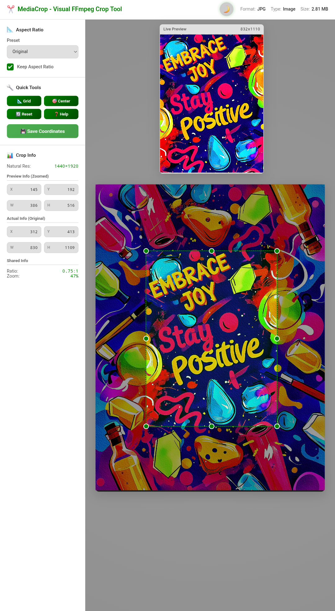
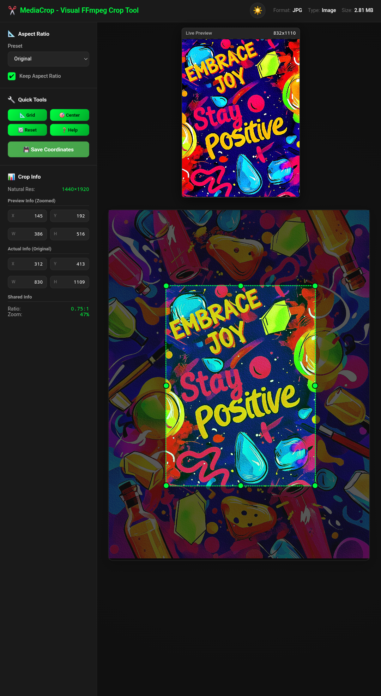

# ✂️ MediaCrop - The Visual FFmpeg Crop Tool

[](https://www.python.org/downloads/)
[](https://opensource.org/licenses/MIT)
[](https://pypi.org/project/mediacrop/)
[](https://pepy.tech/project/mediacrop)
[](https://github.com/mallikmusaddiq1/mediacrop/commits/main)
[](https://github.com/mallikmusaddiq1/mediacrop/stargazers)
[](https://instagram.com/musaddiq.x7)

---

## 🧩 Overview

**MediaCrop** is a modern, lightweight, web-based utility that eliminates the guesswork from cropping media using **FFmpeg**. It offers a clean, intuitive visual interface to obtain precise crop coordinates for any video, image, or audio file. Simply drag, resize, or type in coordinates to instantly generate your perfect FFmpeg crop string.

The tool launches a local web server and automatically opens a sleek, responsive browser interface, complete with **Light & Dark themes**, ensuring a fast, enjoyable, and efficient experience tailored to your preferences.

---

## 📖 The Story Behind MediaCrop

Working with **FFmpeg** provides immense power, but it is rarely intuitive—especially when identifying accurate **crop coordinates**. Traditionally, this process involved a tedious, repetitive cycle:

1. Opening the file in a media player.
2. Estimating coordinates visually by trial and error.
3. Running the FFmpeg command to test the crop.
4. Reviewing the result and iterating on the coordinates.

This endless loop consumed valuable time and energy. **MediaCrop** was created to break this cycle, offering a **visual, drag-and-drop, and type-in solution** that delivers command-line-ready FFmpeg filter strings instantly. No more trial and error. No more frustration. Just **precision made effortless**.

---

## ✨ Key Features

| Category          | Feature                          | Description                                                                 |
|-------------------|----------------------------------|-----------------------------------------------------------------------------|
| **Interface & UX** | 🌌 **Light & Dark Themes**       | Seamlessly switch themes. **Auto-detects OS preference** on first load and saves your choice in local storage. |
|                   | 🖼️ **Resizable Live Preview**    | Real-time preview in a floating, draggable window. Features 8 resize handles, pinch-to-zoom, and **long-press to fullscreen**. |
|                   | 📱 **Responsive Design**         | Automatically adapts to all screen sizes—desktop, tablet, and mobile devices. |
|                   | 🖐️ **Native Touch Experience**   | Full touch support with gestures like **double-tap to zoom**, pinch-to-zoom, and **subtle haptic feedback** on key actions. |
|                   | 💾 **State Persistence**         | **Automatically saves your crop position** and zoom level in your browser. Refreshing the page won't lose your work. |
|                   | 🔔 **Custom Notifications**      | Clean, non-blocking notifications appear on save actions, replacing intrusive browser alerts. |
| **Media Handling**| ⏯️ **Full Video Controls**       | Comprehensive controls including play/pause, seek bar, playback speed adjustment, time display, and volume/mute options. |
|                   | 🎵 **Broad Format Support**      | Previews a wide range of image, video, and audio formats, with graceful fallbacks for unsupported files. |
| **Precision Tools**| 📊 **Bi-directional Info Panel** | Type exact 'Preview' or 'Actual' coordinates. Now supports **click-and-drag "scrubbing"** on labels (X, Y, W, H) for rapid adjustment. |
|                   | 📐 **Aspect Ratio Presets**      | Select standard ratios like *16:9, 4:3, 9:16, 1:1* or input a custom ratio. |
|                   | 🔒 **Keep Aspect Ratio Toggle**  | Dedicated checkbox to lock the crop box's aspect ratio during resizing. |
|                   | 🔎 **Advanced Zoom & Pan**       | Zoom in/out with the mouse wheel or pinch. **Pan the zoomed media** using `Alt + Drag`, middle-mouse drag, or one-finger drag on mobile. |
|                   | ⌨️ **Keyboard Controls**         | Nudge the crop box with Arrow Keys (10px steps) or fine-tune with Shift + Arrow Keys (1px steps). |
|                   | 🔧 **Quick Tools & Context Menu**| Instantly center, toggle grid, or reset via the sidebar or right-click context menu. |
| **System**        | ⚙️ **Zero Dependencies**         | Runs entirely on Python’s standard library—no additional installations required. |
|                   | 🔌 **Smart Port Detection**      | Automatically selects an available port if the default (8000) is occupied. |
|                   | 🔄 **Rotation Metadata Handling**| **Automatically detects video rotation** (e.g., from mobile phones) using `ffprobe` and displays dimensions correctly. |
|                   | 💻 **Advanced Cross-Platform**   | Fully compatible with Windows, macOS, and Linux, including explicit auto-open support for Termux and WSL environments. |
|                   | 🛡️ **Robust CLI**                | Powered by `argparse` for standardized, reliable command-line help (`-h`) and version (`--version`) flags. |

---

## 🖼️ Screenshots

A modern interface available in both light and dark themes, optimized for every device.




---

### 🧠 Supported Preview Formats

**MediaCrop** computes coordinates for **any file readable by FFmpeg**, with native in-browser previews for:

* **Images:** JPG, PNG, WEBP, AVIF, GIF, BMP, SVG, ICO, HEIC, TIFF, JXL
* **Videos:** MP4, WEBM, MOV, OGV
* **Audio:** MP3, WAV, FLAC, OGG, M4A, AAC, OPUS

---

## ⚙️ Installation

Requires **Python 3.7+** and **FFmpeg** (with `ffprobe`) installed and available in your system's PATH.

### Option 1: Install from PyPI (Recommended)

```bash
pip install mediacrop
```

### Option 2: Install from Source

```bash
# Clone the repository
git clone https://github.com/mallikmusaddiq1/mediacrop.git

# Navigate into the project directory
cd mediacrop

# Install the package locally
pip install .
```

---

## 🚀 Usage

Run the command below in your terminal:

```bash
mediacrop "/path/to/your/mediafile.mp4"
```

> **Note:** Always enclose file paths containing spaces in quotes.
> 
> * The tool automatically launches in your default browser at `http://127.0.0.1:8000`.
> * Adjust the crop box visually, apply aspect ratios, or type exact coordinates into the sidebar.
> * Click 💾 **Save Coordinates** to confirm.
>   * The FFmpeg crop filter string (e.g., `crop=...`) appears in your terminal.
>   * Press `Ctrl + C` in the terminal to stop the server.

### 🕹️ Command-Line Options

| Option            | Alias     | Description                                                                 |
|-------------------|-----------|-----------------------------------------------------------------------------|
| `media_file`      |           | Path to the video or image file. (Required)                                 |
| `--port <port>`   | `-p <port>` | Specify a custom server port (default: 8000).                               |
| `--host <host>`   |           | Specify a host address (default: 127.0.0.1).                                |
| `--verbose`       | `-v`      | Enable detailed logs for debugging.                                         |
| `--secure`        | `-s`      | Protect the server with a one-time security token.                          |
| `--version`       |           | Show program's version number and exit.                                     |
| `--help`          | `-h`      | Show this help message and exit.                                            |

### 🎬 Using the Output with FFmpeg

MediaCrop produces a command-line-ready crop filter string, such as:

```
crop=1280:720:320:180
```

Apply it directly in your FFmpeg command:

```bash
ffmpeg -i input.mp4 -vf "crop=1280:720:320:180" output_cropped.mp4
```

---

## ⌨️ Controls & Shortcuts

| Action                  | Control                                      |
|-------------------------|----------------------------------------------|
| Move Crop Box           | Click + Drag / Arrow Keys                    |
| Fine Move (1px)         | Shift + Arrow Keys                           |
| Resize Crop Box         | Drag Edges/Corners / Pinch (Touch)           |
| Set Coordinates Manually| Type in sidebar inputs / Click & Drag on X,Y,W,H labels |
| Zoom Media View         | Mouse Wheel / Pinch (Touch) / Double-Tap (Touch) |
| Pan Media View (when zoomed) | Alt + Drag / Middle-Mouse Drag / One-Finger Drag (Touch) |
| Resize Preview Window   | Drag 8 handles on preview / Pinch (Touch) on preview |
| Fullscreen Preview      | Long-Press on Live Preview Window            |
| Toggle Grid             | G Key                                        |
| Center Crop Box         | C Key                                        |
| Save Coordinates        | Enter Key                                    |
| Toggle Help Panel       | ? Key / Esc to Close                         |
| Access Quick Tools      | Right-Click on Crop Box                      |

---

## 🤝 Contributing

Contributions are warmly welcomed! Whether you fix bugs, add features, or improve documentation—your input helps make MediaCrop even better.

### How to Contribute

* Fork this repository.
* Create a new branch for your update:
  ```bash
  git checkout -b feature/your-feature-name
  ```
* Commit your changes with a clear, descriptive message.
* Open a Pull Request.

If you find this project valuable, please star ⭐ it on GitHub to support future development!

---

## 👨‍💻 Author

**Name:** Mallik Mohammad Musaddiq  
**Email:** [mallikmusaddiq1@gmail.com](mailto:mallikmusaddiq1@gmail.com)  
**GitHub:** [mallikmusaddiq1](https://github.com/mallikmusaddiq1)  
**Project Repo:** [mallikmusaddiq1/mediacrop](https://github.com/mallikmusaddiq1/mediacrop)  
**Instagram:** [@musaddiq.x7](https://instagram.com/musaddiq.x7)

---

## 📄 License

This project is licensed under the MIT License. See the [LICENSE](LICENSE) file for full details.